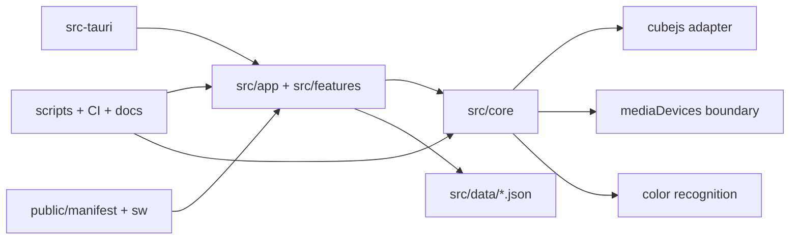

# 아키텍처 결정 기록

## 요구사항 재정의

이 프로젝트는 3x3 큐브를 카메라로 스캔하고, 상태 검증과 풀이 안내를 제공하며, 왕초보부터 CFOP 및 다른 해법까지 학습할 수 있는 브라우저 우선 앱이다. Flutter는 제외한다. 동일한 핵심 로직과 UI를 웹, PWA 모바일, macOS/Windows 데스크톱에서 공유해야 한다.

## 기술 스택 후보 비교

| 후보 | 장점 | 단점 | 판단 |
| --- | --- | --- | --- |
| React/Vite + Tauri + PWA | WebRTC 카메라 안정성, 빠른 웹 배포, Rust 기반 경량 데스크톱 번들, 모바일 PWA 가능, 테스트 쉬움 | 모바일 네이티브 앱스토어 기능은 추가 작업 필요 | 선택 |
| React/Vite + Electron | 카메라와 데스크톱 패키징 안정적, 생태계 큼 | 번들 크기와 메모리 비용 큼 | 보류 |
| Flutter | 단일 UI 코드베이스 | 사용자 제한사항에서 제외 | 제외 |
| React Native/Expo + 웹 + 데스크톱 래퍼 | 모바일 네이티브 강점 | 데스크톱/웹 UI 공유와 CV 캔버스 처리 복잡도 증가 | 보류 |
| Next.js + Tauri | 라우팅/서버 기능 강함 | 현재 MVP에는 서버 렌더링 이점이 작고 빌드 복잡도 증가 | 보류 |

## 최종 기술 스택

- UI: React 19 + Vite + TypeScript
- 플랫폼: Web SPA, PWA, Tauri 2 desktop packaging
- 큐브 솔버: `rubiks-cube-solver` CFOP/Fridrich adapter
- 컴퓨터비전 MVP: Canvas `ImageData` 샘플링, CIE Lab 색상 거리, 흰색 기준 보정
- 테스트: Vitest + jsdom
- 하네스: Node 검증 스크립트, GitHub Actions, 문서/단계 보고서

선택 기준 우선순위에 따라 카메라 안정성과 웹 배포 가능성을 최우선으로 두었다. Tauri는 Electron보다 가볍고, PWA는 초기 모바일 요구를 충족하면서 향후 네이티브 확장을 막지 않는다.

## 전체 아키텍처

## 계층 경계

- `src/core`: 모델, 큐브 상태, 회전 시뮬레이션, 색상 인식, 솔버, 진도 저장. UI import 금지.
- `src/data`: 공식과 커리큘럼 JSON. 새 해법은 데이터 추가로 확장.
- `src/features`: 카메라, 스캔, 풀이, 학습, 기록, 설정 UI.
- `src/app`: 앱 shell과 화면 조합.
- `scripts`: 에이전트/CI가 읽는 검증 하네스.
- `src-tauri`: 플랫폼별 데스크톱 패키징.

## 데이터 모델 설계

주요 모델은 `src/core/models.ts`에 정의한다.

- CubeState, CubeFace, CubeSticker
- ScanSession, ColorProfile
- SolverResult, Move
- Method, Stage, Lesson
- Algorithm, AlgorithmCase
- UserProgress, PracticeSession, PracticeResult, UserSettings

자세한 필드 설명은 `DATA_MODEL.md`를 기준으로 한다.

## 단계별 개발 계획

1. 실행 가능한 앱과 하네스 구조 생성
2. 카메라 프리뷰
3. 3x3 스캔 UI
4. 색상 보정
5. 6면 스캔 워크플로우
6. 상태 문자열 생성/검증
7. 풀이 알고리즘 연동
8. 단계별 풀이 UI
9. 왕초보/초보 학습
10. CFOP 학습
11. D-Cross/F2L/OLL/PLL 세부 화면
12. 공식 라이브러리
13. 랜덤 테스트/약점 복습
14. 다른 해법
15. 진도/기록 저장
16. 웹 빌드
17. macOS Tauri 설정
18. Windows Tauri 설정
19. 모바일 PWA
20. 최종 문서화/검증

## 각 단계의 완료 기준

각 단계는 실행 가능한 앱 상태, 코드 또는 데이터 산출물, 테스트 또는 수동 확인 방법, 단계 결과 보고서를 남긴다. 전체 단계 보고서는 `docs/stage-reports/STAGE_REPORTS.md`에 있다.

## 위험 요소와 대응책

| 위험 | 대응 |
| --- | --- |
| 자동 색상 인식 오차 | 색상 보정, Lab 거리 비교, 수동 수정 UI를 기본 제공 |
| 불가능한 큐브 상태 | 54자/색상 수/센터 검증 후 solver 오류를 사용자에게 표시 |
| solver 표기법 차이 | adapter에서 상태 순서 변환과 표준 단일 면 회전 필터링 |
| 플랫폼별 카메라 권한 차이 | 카메라 접근을 `src/core/camera.ts` 경계로 격리 |
| 학습 데이터 확대에 따른 코드 수정 | JSON 기반 Method/Algorithm 구조 |
| 에이전트 작업 드리프트 | 하네스 문서, 구조 검증 스크립트, CI, 단계 보고서로 제어 |

## 하네스 엔지니어링 적용

OpenAI의 하네스 엔지니어링 글은 에이전트가 읽고 검증할 수 있는 저장소 구조, 짧은 PR, 구조적 규칙, 테스트/리뷰/피드백 루프를 강조한다. 이 저장소는 `AGENTS.md`를 목차로 두고, 실제 지식은 `docs/`, `ARCHITECTURE.md`, `TEST_PLAN.md`, `scripts/`와 CI에 둔다.

Source: https://openai.com/ko-KR/index/harness-engineering/
